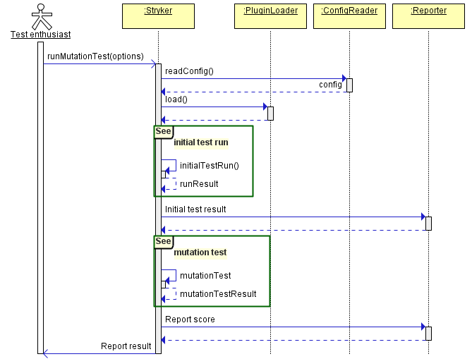
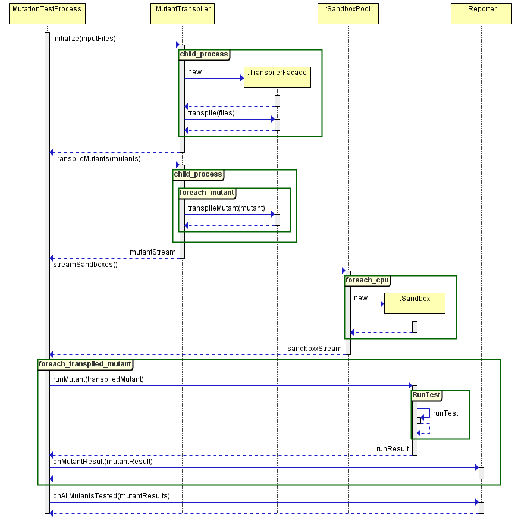
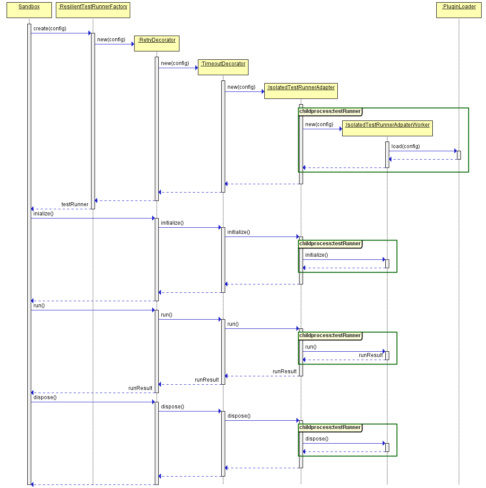

 # Technical reference

This page contains a technical explanation about how Stryker works underneath. 
It is a great place to start for new people eager to contribute to the Stryker project.
Of course, you are free to read it for entertainment purposes as well.
It is still a work in progress. Feedback is welcome! Please drop a line on [our gitter](https://gitter.im/stryker-mutator/stryker)
to let us know how to improve.

Jump right to a section:

* [Main stryker life cycle](#main-stryker-life-cycle)
* [Initial test run process](#initial-test-run-process)
* [Mutation test process](#mutation-test-process)
* [Run test](#run-test)

*Sequence diagrams are rendered from clear text using [sdedit](https://npmjs.org/package/sdedit)*

## Main stryker life cycle

High over, the Stryker life cycle looks like this:

1. Read the config. 
2. Load the plugins (using `require('plugin-name');`).
3. Perform the [initial test process](#initial-test-run-process) 
4. If that went well, perform the [mutation test process](#mutation-test-process)

Let's take a look at the sequence diagram.

Next, we'll look at each step in more detail.

## Initial test run process

The initial test run process runs for these reasons:

* Verify that the tests pass under normal circumstances.
* Verify that the stryker pipeline is configured correctly (sandboxes and transpilers mainly)
* Record code coverage if requested (coverage analysis `"all"` or `"perTest"`)
* Record how long all tests run in normal circumstances.

This is what happens:

As you can see first, the input files are transpiled using the configured transpilers.
This process is done entirely in memory for performance reasons.
Next, the transpiled output is used to configure a `Sandbox`. This, in turn, will copy the transpiled files to a 
a sub-folder in the .stryker-temp directory.

See the [Run test](#run-test) sequence diagram for more details on how exactly the Sandbox interacts with the test runner.

## Mutation test process

The mutation test process is responsible for:

* Transpiling each mutant to executable javascript (if needed)
* Running each mutant in a sandbox
* Reporting the results to the configured reporter(s)

Because this process is the most time consuming, it tries to do this as efficient as possible:

* Transpiling of mutants is done in a separate process (if needed).
* Running each mutant in a test runner is of course also done inside a separate child process.

Without further ado:

## Run test

The running of test(s) inside a test runner is done in both the [initial test run process](#initial-test-run-process) 
and the [mutation test process](#mutation-test-process). It is implemented as a [decorator pattern](https://en.wikipedia.org/wiki/Decorator_pattern),
each new decorator adding a small bit of functionality. The most important one is the `IsolatedTestRunnerAdapter` decorator.
It is responsible for running the inside a child process. This allows for a test runner to be killed if it is hanging in an infinite loop because 
of a stray mutant.

